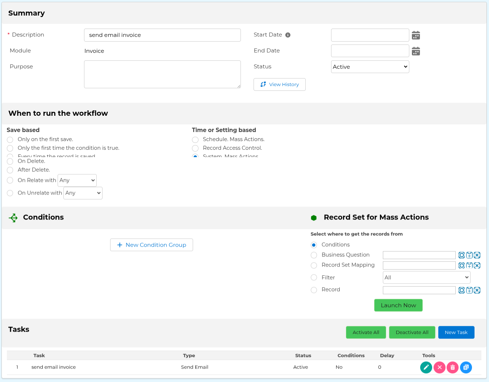

# coreBOS/Evolutivo.FW MCP Server

[](LICENSE)
[](https://www.python.org/downloads/)

A Model Context Protocol (MCP) server for seamless interactions with Evolutivo.FW and coreBOS applications. Built with Python [FastMCP](https://github.com/jlowin/fastmcp), this server enables AI assistants to interact with your Evolutivo/coreBOS instance through standardized MCP tools.

## Features

This MCP server provides comprehensive access to your Evolutivo.FW/coreBOS application with the following capabilities:

### Data Operations
- **Query Records**: Execute SQL-like queries (VTQL) to retrieve data
- **Create Records**: Create new records in any entity with field validation
- **Retrieve Records**: Get complete record information by WSID
- **Update Records**: Modify existing records with field updates
- **Delete Records**: Remove records from entities

### Metadata & Discovery
- **List Entities**: Get all accessible entities/modules
- **Entity Information**: Retrieve entity names and metadata
- **Field Information**: Get field definitions and properties
- **Filter Fields**: Access filter field configurations
- **Related Modules**: Discover entity relationships

### Advanced Features
- **Email Sending**: Send emails using workflow templates
- **Natural Language Queries**: Chat-based query interface
- **Resource Management**: Access documentation, templates, and version info
- **Prompt Assistance**: Get AI-generated prompts for create/update operations

## Prerequisites

- **Python**: 3.10 or higher
- **UV Package Manager**: For dependency management ([install uv](https://docs.astral.sh/uv/))
- **Evolutivo.FW or coreBOS**: A running instance with web services enabled
- **API Credentials**: Valid username and password for API access

## Installation

### 1. Clone the Repository

```bash
git clone https://github.com/coreBOS/MCP.git evmcp
cd evmcp
```

### 2. Create Virtual Environment

```bash
cd src
python -m venv .venv
source .venv/bin/activate  # On Windows: .venv\Scripts\activate
```

### 3. Install Dependencies

Using UV (recommended):

```bash
uv sync
```

Or using pip:

```bash
pip install -e .
```

## Configuration

### 1. Environment Setup

Create a `.env` file in the `src` directory based on the provided sample:

```bash
cd src
cp env.sample .env
```

### 2. Configure Connection Parameters

Edit the `.env` file with your Evolutivo/coreBOS connection details:

```bash
# Parameters for Connections
EVAPI_URL=http://localhost/coreBOSNG
EVAPI_USER=admin
EVAPI_PASS=your_access_key_here
```

**Important Notes:**
- `EVAPI_URL`: The base URL of your Evolutivo/coreBOS installation
- `EVAPI_USER`: Username with webservices access
- `EVAPI_PASS`: Use the **Access Key**, not the login password (found in user preferences)

### 3. Sending emails

The MCP server is designed to delegate the sending of emails to the Evolutivo backend. You must configure a manual workflow for each module you want to send emails from with the exact name `send email {modulename}`, where modulename is the name of the module in lower case.



The send email task has no values set as they will all be overwritten by the MCP when using it.

As an additional note you can configure specific workflows with GenDoc templates for inventory modules and force the MCP to use those workflows instead of the default one making it super simple to send invoices with PDFs attached.

## Usage

### Running the MCP Server

#### Method 1: Using UV (Recommended)

From the `src` directory:

```bash
cd src
source .venv/bin/activate
uv run main.py
```

#### Method 2: Direct Python Execution

```bash
cd src
source .venv/bin/activate
python main.py
```

### Testing with MCP Inspector

The MCP Inspector is a powerful tool for testing and debugging your MCP server:

```bash
cd src
source .venv/bin/activate
uv run mcp dev main.py
```

This will:
1. Start the MCP server
2. Launch the MCP Inspector web interface
3. Open your browser to interact with available tools
4. Allow you to test tool calls and inspect responses

The Inspector provides:
- Interactive tool testing
- Request/response inspection
- Schema validation
- Real-time debugging

## Configuration for Google Gemini CLI

To use this MCP server with Google's Gemini CLI, you need to configure it in the MCP settings file.

### 1. Locate Gemini Configuration

The Gemini configuration file is typically located at:
- **Linux/macOS**: `~/.config/gemini-mcp/mcp.json`
- **Windows**: `%APPDATA%\gemini-mcp\mcp.json`

### 2. Add Server Configuration

Add the following configuration to your `mcp.json`:

```json
{
  "mcpServers": {
    "evolutivo": {
      "command": "/home/joe/.local/bin/uv",
      "args": [
        "--directory",
        "/home/joe/workspace/evmcp/src",
        "run",
        "main.py"
      ],
      "env": {
        "EVAPI_URL": "http://localhost/coreBOSNG",
        "EVAPI_USER": "admin",
        "EVAPI_PASS": "your_access_key_here"
      }
    }
  }
}
```

**Adjust the paths:**
- Replace `/home/joe/.local/bin/uv` with your UV binary path
- Replace `/home/joe/workspace/evmcp/src` with your actual project path
- Update the environment variables with your connection details

### 3. Verify Configuration

Test the configuration with:

```bash
gemini-cli --list-tools
```

You should see all the Evolutivo MCP tools listed.

## Available Tools

The server exposes the following MCP tools:

### Data Operations
- `launch_query(select, object_name, where, order_by, limit)` - Execute VTQL queries
- `create_record(entity, fields)` - Create new records
- `retrieve_record(wsid)` - Get record by WSID
- `update_record(wsid, fields)` - Update existing records
- `delete_record(wsid)` - Delete records

### Metadata
- `get_entities()` - List all accessible entities
- `get_entity_name(wsid)` - Get entity name from WSID
- `get_fields(entity)` - Get field definitions for an entity
- `get_filter_fields(entity)` - Get filter field configurations
- `get_related_modules(wsid)` - Get related entities

### Advanced
- `send_email(workflow, wsids, context)` - Send workflow-based emails
- `query_chat(question, entity)` - Natural language queries
- `get_prompt_create(entity, description)` - AI prompt for create operations
- `get_prompt_update(wsid, description)` - AI prompt for update operations
- `get_resource_doc(type)` - Access documentation
- `get_resource_tpl()` - Get templates
- `get_resource_version()` - Get version information
- `get_data(...)` - Generic data retrieval with multiple parameters

## Project Structure

```
evmcp/
├── src/
│   ├── main.py                 # Entry point
│   ├── pyproject.toml          # Project dependencies
│   ├── .env                    # Configuration (create from env.sample)
│   ├── tools/                  # MCP tool implementations
│   │   ├── __init__.py         # Tool registration
│   │   ├── create.py
│   │   ├── retrieve.py
│   │   ├── update.py
│   │   ├── delete.py
│   │   ├── query_sql.py
│   │   ├── entities.py
│   │   └── ...
│   ├── evapi/                  # Evolutivo API wrappers
│   │   ├── connect.py
│   │   ├── query.py
│   │   ├── create.py
│   │   └── ...
│   ├── wslib/                  # WebService client library
│   │   └── WSClient.py
│   └── helper/                 # Utilities
│       └── mcplogger.py
├── run_evolutivo.sh            # Launch script
├── README.md
└── LICENSE
```

## Development

### Adding New Tools

1. Create a new file in `src/tools/` (e.g., `my_tool.py`)
2. Implement the `register(mcp: FastMCP)` function
3. Define your tool using the `@mcp.tool()` decorator
4. The tool will be automatically discovered and registered

Example:

```python
from mcp.server.fastmcp import FastMCP

def register(mcp: FastMCP):
    @mcp.tool()
    async def my_tool(param: str):
        """
        Tool description here.
        
        Args:
            param (str): Parameter description
            
        Returns:
            str: Return value description
        """
        # Implementation
        return result
```

### Logging

Logs are written to `src/logs/evmcp.log`. Configuration is in `src/logging.conf`.

## Troubleshooting

### Connection Issues

If you encounter connection errors:

1. **Verify your `.env` configuration**:
   - Ensure `EVAPI_URL` points to your running instance
   - Use the Access Key, not the login password for `EVAPI_PASS`

2. **Check webservices are enabled** in your Evolutivo/coreBOS installation

3. **Test the connection** manually:
   ```bash
   cd src
   source .venv/bin/activate
   python -c "from evapi.connect import EVConnect; conn = EVConnect(); print('Connected!' if conn.is_connected() else 'Failed')"
   ```

### Tool Errors

- Check the log file: `src/logs/evmcp.log`
- Use MCP Inspector to debug tool calls
- Verify field names and entity names match your application's schema

## Technology Stack

- **FastMCP**: MCP server framework
- **httpx**: Async HTTP client
- **python-dotenv**: Environment configuration
- **requests**: HTTP library for API calls

## License

This project is licensed under the Apache License 2.0 - see the [LICENSE](LICENSE) file for details.

## Author

**Joe Bordes** Evolutivo/TSolucio

## Contributing

Contributions are welcome! Please feel free to submit issues or pull requests.

## Resources

- [Model Context Protocol](https://modelcontextprotocol.io/)
- [FastMCP Documentation](https://github.com/jlowin/fastmcp)
- [Evolutivo Support](https://evolutivo.io)
- [TSolucio Support](https://tsolucio.com)
- [Evolutivo.FW Documentation](https://corebos.com/docs_grav/)
- [Evolutivo.FW Blog](https://blog.evolutivo.it/)

## Support

For issues related to:
- **MCP Server**: Open an issue in this repository
- **Evolutivo/coreBOS**: Consult the respective project documentation
- **API Access**: Check your Evolutivo/coreBOS webservices configuration
